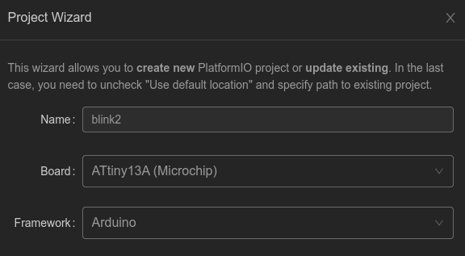
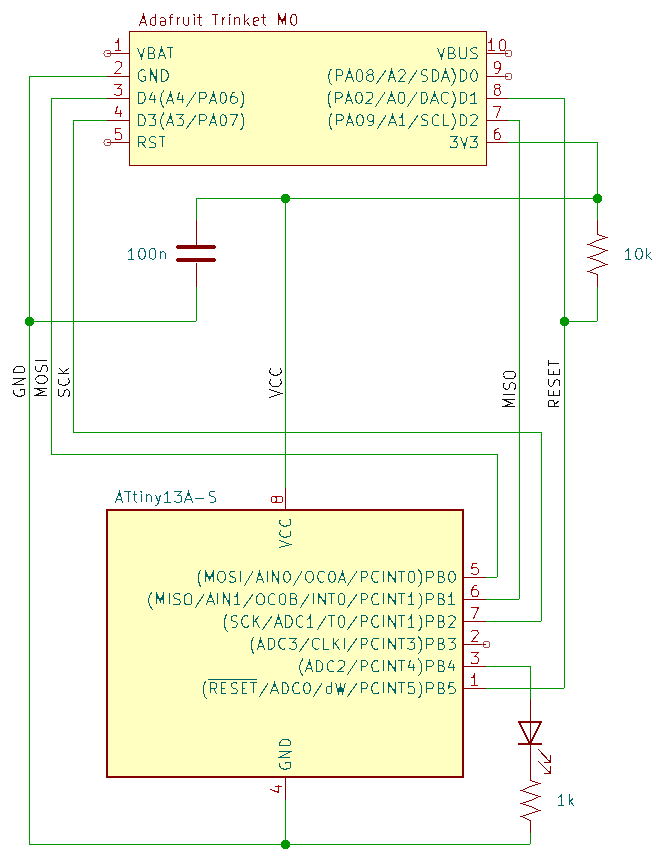

# TrinketISP

This is a fork of the original [ArduinoISP](https://docs.arduino.cc/built-in-examples/arduino-isp/ArduinoISP/) that has been adapted for the [Adafruit Trinket M0](https://learn.adafruit.com/adafruit-trinket-m0-circuitpython-arduino) based on the SAMD21 microprocessor (note: there are multiple variants of the Trinket). While I haven't tested it, this should also work just as well with other small SAMD21 boards, e.g. 
* Adafruit QtPy
* Seeed Xiao
* Adafruit ItsyBitsy M0 Express

## Key Changes

* Forces the use of the bit-bang SPI implementation: the Trinket uses hardware SPI to write to the DotStar, and it was easier to do this than mess around with the SerComs. 
* Uses the on-board LEDs for status: no external LEDs are required.
    * The built-in LED (pin 13) indicates "programming in progress" (re-mapped `LED_PMODE`)
    * The DotStar (like a NeoPixel but with fewer examples and less documentation) is used for the heartbeat (green pulse) and error indicator (solid red). 
* Forces the use of the default `Serial` object
* Uses different pins than the "classic" Ardino Uno exmaples 
    * Reset (active low): 1
    * MOSI: 4
    * MISO: 2
    * SCK: 3

## Usage

There are many (many) guides available. The main differences here are

* Using PlatformIO for firmware development for the ATTiny: the Trinket is just going to be a standalone ISP.
* No bootloader: intendeded for small microcontrollers.
* Using 3.3V for programming (most guides assume 5V); no level translation is required.

The following was tested with an ATTiny13a.

1. Program the Trinket M0 with the trinketISP sketch using the Arduino IDE (checked with v2.3.x).
    * the Trinket should not be connected to anything else
    * once complete, the DotStar will pulse green (heartbeat) and the built-in LED (programming) will be off.
    * this Trinket is now ready to act as an in-circuit serial programmer (ISP), which does not require the Arduino development environment anymore.
2. Configure a PlatformIO project in VSCode that targets the ATTiny microcontroller. Choose the project location per your preference.

    

    This should result in the following platformio.ini. The `blink` example has some additional settings which may or may not be required (source: [Atmel AVR Platform notes on PlatformIO](https://docs.platformio.org/en/latest/platforms/atmelavr.html)).

    ```ini
    [env:attiny13a]
    platform = atmelavr
    board = attiny13
    framework = arduino
    ```
3. Write your test code (edit main.cpp, see `blink` example), compile and check. 
4. Connect your micro to the Trinket. It's recommended to use a 10k pull-up to VCC on the Reset connection and a 100nF capacitor between VCC and GND. Also, keep in mind that the circuit connected to the ATTiny must be tolerant to the electrical conditions for programming:
    * VCC will be powered with 3.3V
    * Signals will be applied from the Trinket to MOSI, SCK, and RST (other interfaces should present high impedance)
    * MISO must be driveable by the ATTiny (other interfaces should present high impedance)

    | Connection | Trinket M0 | ATTiny13a |
    |------------|------------|-----------|
    | Reset      | D1         | 1 (RESET) |
    | MOSI       | D4         | 5 (MOSI)  |
    | MISO       | D2         | 6 (MISO)  |
    | SCK        | D3         | 7 (SCK)   |
    | GND        | GND        | 4 (GND)   |
    | VCC (3.3V) | 3V         | 8 (VCC)   |

    
    
## Troubleshooting

* ISP can't find a device to program: likely the SPI connection is incorrect. Resolution: switch to bit-bang SPI.
* Wrong device signature ("AVR device initialized and ready" -- serial comms with the ISP is OK; "expected signature for the ATTiny13a is 1E 90 07" -- received 0x000302). Resolution: SPI clock is too fast, reduce to 100kbps or lower
* Verification error (first mismatch at byte 0x0000, 0xff != 0x09). The blink code didn't execute, so device was not programmed correctly. Resolution: switch the USB connection to Trinket M0 from a hub to a USB port on the PC.

## References

1. [ATTiny13A Datasheet](https://www.microchip.com/content/dam/mchp/documents/MCU08/ProductDocuments/DataSheets/ATtiny13A-Data-Sheet-DS40002307A.pdf) section 18.8 "Serial Programming Characteristics"
2. [ArduinoISP](https://docs.arduino.cc/built-in-examples/arduino-isp/ArduinoISP/)
3. [Trinket M0](https://learn.adafruit.com/adafruit-trinket-m0-circuitpython-arduino) although the lack of documentation on how to use serial comms (SPI, I2C) in C is challenging. The [old pinout](https://cdn-learn.adafruit.com/assets/assets/000/049/778/medium800/adafruit_products_Adafruit_Trinket_M0.png?1514756138) has more info on possible SPI/I2C connections.
4. [PlatformIO/Development Platforms/Atmel AVR](https://docs.platformio.org/en/latest/platforms/atmelavr.html) 

